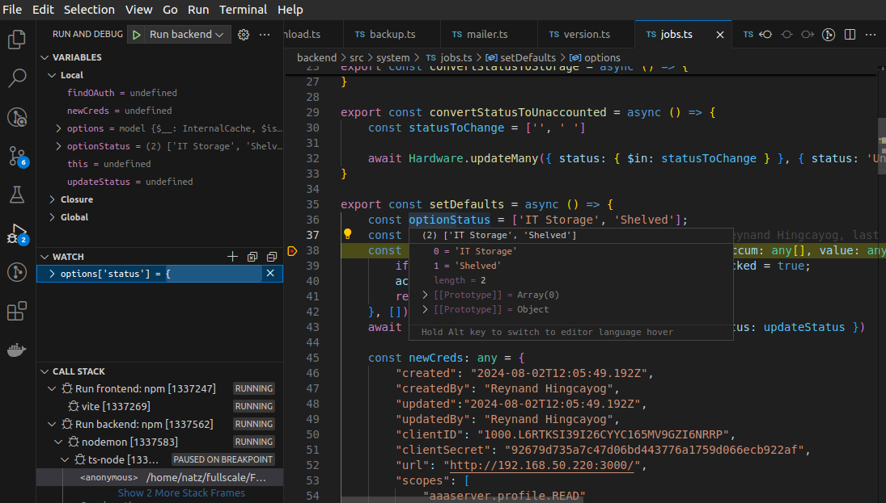
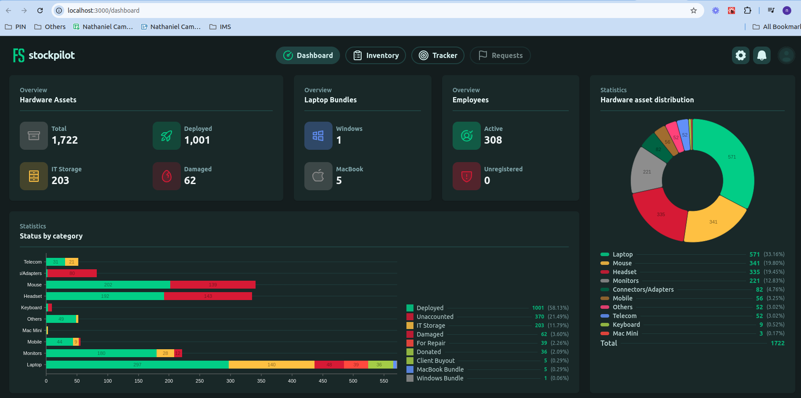

# FS Inventory System

## Local setup using Docker
1. Clone this repository, checkout `staging` branch, build dependencies
```sh
git clone https://github.com/FSInventoryOrg/FSInventory.git
git checkout staging
cd backend
npm ci
cd ../frontend
npm ci
```
2. Create `backend/.env` config file. Ask teammate for updated values.
3. Create `frontend/.env` config file. Add this value:
```sh
VITE_API_BASE_URL=http://localhost:8080
```
4. Add server entry in `frontend/vite.config.ts`
```ts
export default defineConfig({
  server: {
    port: 3000,
  },
 // other config
})
```

### Setup MongoDB
5. Install docker, if haven't yet. https://docs.docker.com/engine/install/
6. Download the backup zip (inventory_data.zip somewhere in zoho chat). Unarchive somewhere.
7. Add the path to the `inventory` folder to `backend/.env`
```sh
DUMP_DIRECTORY=<path to inventory folder>
```
8. Run mongodb. This has replica set enabled and automatically restores the dump files.
```sh
cd backend
docker compose up
```
9. Install mongodb compass (or any mongodb client/gui that you like). Connect using this connecting string: `mongodb://127.0.0.1:27017?replicaSet=rs0`. Test that you can connect and the inventory database was populated.
10. Add/modify your mongodb connection string in `backend/.env`:
```sh
MONGODB_CONNECTION_STRING=mongodb://127.0.0.1:27017/inventory?replicaSet=rs0
```
### Running/Debugging
11. Add `.vscode/launch.json` config for running always with debugging enabled:
```json
{
    "version": "0.2.0",
    "configurations": [
        {
            "command": "npm run dev",
            "name": "Run backend",
            "request": "launch",
            "type": "node-terminal",
            "cwd": "${workspaceFolder}/backend",
            "envFile": "${workspaceFolder}/backend/.env"
        },
        {
            "command": "npm run dev",
            "name": "Run frontend",
            "request": "launch",
            "type": "node-terminal",
            "cwd": "${workspaceFolder}/frontend",
            "envFile": "${workspaceFolder}/frontend/.env"
        }
    ]
}
```
12. Go to `Run and Debug`, CTRL+SHIFT+D, Run both `Run backend` and `Run frontend`. Add breakpoints and debug.



13. Visit `http://localhost:3000`

